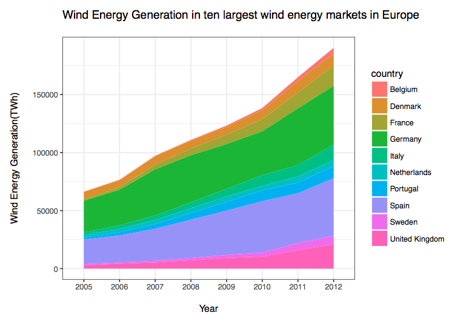
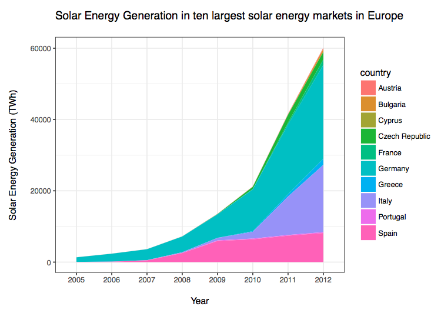

```{r setup, include=FALSE}
knitr::opts_chunk$set(echo = FALSE)
```

# What is the current RE uptake across EU countries? 

```{r, include=T, message=F, warning=FALSE, error=FALSE, echo=FALSE, type = 'html', results='asis'}
setwd("~/Desktop/CollaborativeDataMethods/VieiraKhanna_Assignment3/data_cleaning")

# Importing and cleaning data from Eurostat
source('Eurostat_and_Opec_data.R')

# Importing and cleaning data from World Bank
source('WDI_data.R')

# Merging the data
re_data <- merge(Combined_WDI,Combine_EuroStat,by = c("country", "year"), all.x = T, all.y = T)

# Remove missing values
re_data1 <- na.omit(re_data)

#creating var for solar and wind gen as percent of total elec consumption
re_data1$sw_pc_elec <- re_data1$re_gen/re_data1$elec_total*100 

library(googleVis)
# Plot
re_map <- gvisGeoChart(re_data1, locationvar = 'country',
                      colorvar = 'sw_pc_elec',
                      options = list(
                        colors = "['#f7fcb9', '#31a354']",
                        region ="150"
                          ))
print(re_map, tag = 'chart')
```

# Has RE generation increased substantially over the last years?

## 
## 


#What are the determinants of RE generation in EU countries?

## Variables, Sources and Model

### Independent variables:
- GDP per Capita and Net Energy Imports (WDI)
- Innovation in RE and long-term interest rates (Eurostat)
- Crude oil prices (OPEC)

### Model:
- Panel Data with 28 EU-countries (2005-2013)

# Oil Prices in RE

```{r, include=F, message=F, warning=FALSE, error=FALSE, echo=FALSE, eval=FALSE}
library(plm)
m.fe.i  <- plm(sw_pc_elec ~ oil_price*netenergy_imports + log(GDP_capita) + patents + interest_rate, data= re_data1, index=c("country", "year"), model="within")
summary(m.fe.i)

vcov(m.fe.i) #variance covariance matrix

vb1 <- vcov(m.fe.i)[1]
vb3 <- vcov(m.fe.i)[6,6]
cvb1b3 <- vcov(m.fe.i)[1,6]
margins <- data.frame(
  netenergy_imports = min(re_data1$netenergy_imports, na.rm =T):max(re_data1$netenergy_imports, na.rm =T),
  me = coef(m.fe.i)[1] + coef(m.fe.i)[6] * ( 
  min(re_data1$netenergy_imports, na.rm =T):max(re_data1$netenergy_imports, na.rm =T)),
  se = sqrt(vb1 + (min(re_data1$netenergy_imports, na.rm =T):max(re_data1$netenergy_imports, na.rm =T))^2 * vb3 + 2 *(min(re_data1$netenergy_imports, na.rm =T):max(re_data1$netenergy_imports, na.rm =T)) * cvb1b3)
)
margins$lwr <- margins$me - 1.96 * margins$se
margins$upr <- margins$me + 1.96 * margins$se

library(ggplot2)

ggplot(data = margins, aes(x = netenergy_imports, y = me, ymin = lwr, ymax = upr)) +
  geom_ribbon(fill = 'blue', alpha = 0.2) + 
  geom_line(colour = "red", size =1) + theme_bw() + 
  geom_hline(yintercept = 0, linetype = 'dashed') + 
  xlab("\nEnergy Imports (% of consumption)") + 
  ylab("Marginal Effect of Oil Price\n") +
  ggtitle("Marginal Effect of Oil Price conditioned over Import Intensity of Energy\n") +
  theme(panel.background = element_rect(fill = 'white', colour = 'black'))
```

# GDP per Capita 


# Overall Results and Conclusion