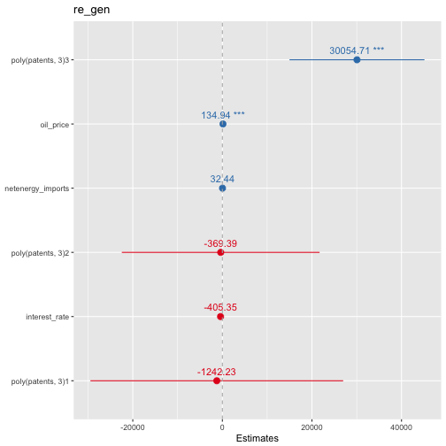
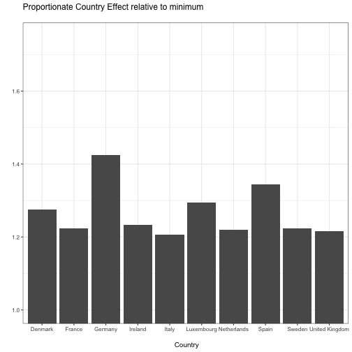
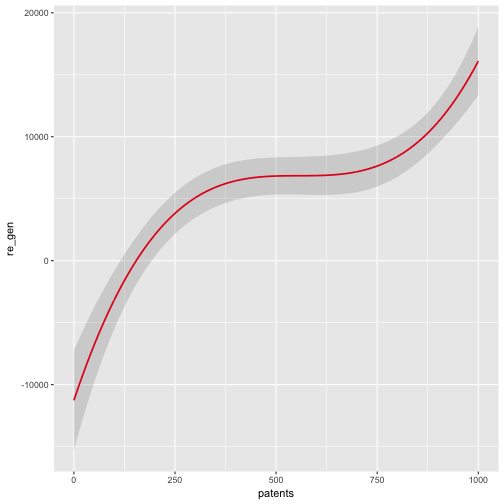
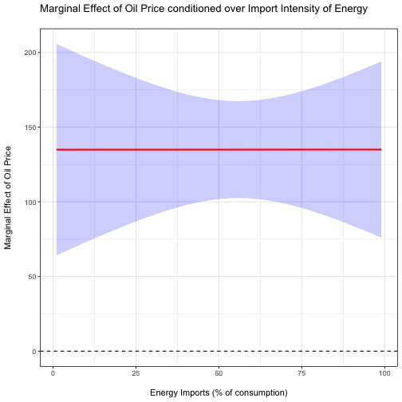

Determinants of Renewable Energy Investments: An EU Cross-Country Analysis
========================================================
author: Camila Vieira & Tarun Khanna
date: 2 December 2016
autosize: true

Agenda
========================================================
 
- Why Renewable Energy(RE) Investments? 
- RE Investments through Electricity Generation (Wind and Solar Energy)
- Variables, Sources and Models
- Results of Statistical Analysis
- Main Results (1): Relative FE per country
- Main Results (2): Effect of Patents
- Main Results (3): Effect of Oil Price * Energy Intensity

Why Green Investments...
========================================================
right: 65%
 
 

***
 
- Cope with the effects of climate change
- Accelerate potential alternatives
- Focus on mitigation: 
 (+) Reduce CO2 emissions w/ efficiency gains in E consumption/production
 (+) Adoption of other forms of energy production

**Research Question:**
 
What are the determinants of investments in RE?

Renewable Electricity Generation in European Countries
========================================================
 
 
 

***
 
 
 

Variables, Sources and Models 
========================================================
 
**Dependent variable:**
  - Electricity generation from 
Renewable Energy Sources (Eurostat)
 
 
**Independent variables:** 
  - GDP per Capita and Net Energy Imports (WDI)
 - Innovation in RE and long-term interest rates (Eurostat)
 - Crude oil prices (OPEC)
 
 
**Models**:
 *Panel Data with 28 EU-countries (2005-2013)*
  - Pooled OLS + Relative Fixed Effects

Results of Statistical Analysis (1)
========================================================

\begin{tabular}{@{\extracolsep{5pt}}lcc} 
\\[-1.8ex]\hline 
\hline \\[-1.8ex] 
 & \multicolumn{2}{c}{\textit{Dependent variable:}} \\ 
\cline{2-3} 
\\[-1.8ex] & \multicolumn{2}{c}{Renewable Energy} \\ 
\\[-1.8ex] & (1) & (2)\\ 
\hline \\[-1.8ex] 
 GDP per capita (constant 2000 US$) & $-$5,140.726$^{***}$ & $-$22,040.010$^{***}$ \\ 
  & (1,313.410) & (6,685.495) \\ 
  & & \\ 
 Energy Imports (% of total energy) & 124.806$^{***}$ & 35.784 \\ 
  & (24.141) & (58.786) \\ 
  & & \\ 
 Interest Rate & 184.328 & $-$191.850 \\ 
  & (303.847) & (178.260) \\ 
  & & \\ 
 Oil Price & 32.588 & 97.223$^{***}$ \\ 
  & (29.882) & (16.435) \\ 
  & & \\ 
 poly(patents, 3)1 & 143,344.100$^{***}$ & 32,639.910$^{**}$ \\ 
  & (11,138.510) & (14,004.550) \\ 
  & & \\ 
 poly(patents, 3)2 & $-$28,074.010$^{**}$ & $-$12,537.660 \\ 
  & (11,001.800) & (11,162.880) \\ 
  & & \\ 
 poly(patents, 3)3 & 61,063.540$^{***}$ & 40,002.590$^{***}$ \\ 
  & (9,722.244) & (6,797.071) \\ 
  & & \\ 
 Constant & 47,913.670$^{***}$ &  \\ 
  & (13,607.160) &  \\ 
  & & \\ 
\hline \\[-1.8ex] 
Observations & 208 & 208 \\ 
R$^{2}$ & 0.522 & 0.396 \\ 
Adjusted R$^{2}$ & 0.502 & 0.334 \\ 
F Statistic & 31.181$^{***}$ & 16.419$^{***}$ \\ 
\hline 
\hline \\[-1.8ex] 
\textit{Note:}  & \multicolumn{2}{r}{$^{*}$p$<$0.1; $^{**}$p$<$0.05; $^{***}$p$<$0.01} \\ 
 & \multicolumn{2}{r}{(1) pooled OLS (2) Fixed effects} \\ 
\end{tabular} 

Results of Statistical Analysis (2)
========================================================

Main Results (1): Country specific effects
========================================================

Main Results (2): Effect of Innovation
========================================================

Main Results (3): Effect of Oil Price 
========================================================

Thank you!
========================================================

