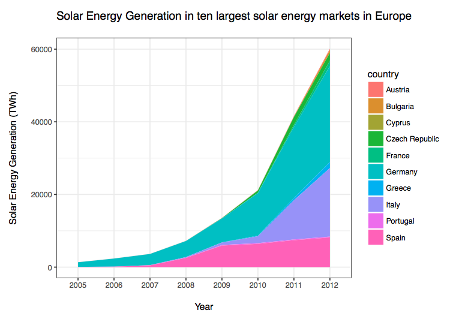

Determinants of Renewable Energy Investments: An EU Cross-Country Analysis
========================================================
author: Camila Vieira & Tarun Khanna
date: 2 December 2016
autosize: true

Agenda
========================================================
<br>
- Why Renewable Energy(RE) Investments? 
- RE Investments through Electricity Generation (Wind and Solar Energy)
- Variables, Sources and Models
- Results of Statistical Analysis
- Main Results (1): Relative FE per country
- Main Results (2): Effect of Patents
- Main Results (3): Effect of Oil Price * Energy Intensity

Why Green Investments...
========================================================
right: 65%
<br>
<br>


***
<br>
- Cope with the effects of climate change
- Accelerate potential alternatives
- Focus on mitigation: 
<br>(+) Reduce CO2 emissions w/ efficiency gains in E consumption/production
<br>(+) Adoption of other forms of energy production

**Research Question:**
<br>
What are the determinants of investments in RE?

Green investments through Electricity Generation (Wind and Solar Energy)
========================================================


***




Variables, Sources and Models 
========================================================
<br>
**Dependent variable:**
<br> - Electricity generation from 
Renewable Energy Sources (Eurostat)
<br>
<br>
**Independent variables:** 
<br> - GDP per Capita and Net Energy Imports (WDI)
<br>- Innovation in RE and long-term interest rates (Eurostat)
<br>- Crude oil prices (OPEC)
<br>
<br>
**Models**:
<br>*Panel Data with 28 EU-countries (2005-2013)*
<br> - Pooled OLS + Relative Fixed Effects


Results of Statistical Analysis 
========================================================


```
Error in loadNamespace(i, c(lib.loc, .libPaths()), versionCheck = vI[[i]]) : 
  object 'vI' not found
In addition: Warning messages:
1: package 'rvest' was built under R version 3.2.5 
2: package 'xml2' was built under R version 3.2.5 
3: package 'dplyr' was built under R version 3.2.5 
4: package 'plyr' was built under R version 3.2.5 
5: In eval(expr, envir, enclos) : NAs introduced by coercion
6: In eval(expr, envir, enclos) : NAs introduced by coercion
7: package 'plm' was built under R version 3.2.3 
Quitting from lines 70-104 (Presentation_FinalProject.Rpres) 
Error: package or namespace load failed for 'plm'
Execution halted
```
