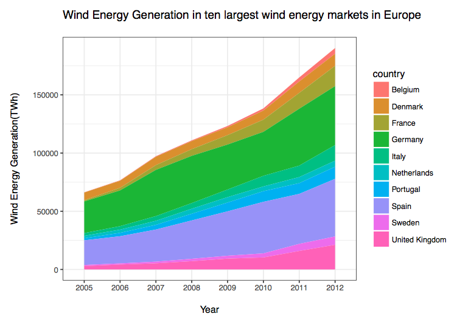

Determinants of Renewable Energy Investments: An EU Cross-Country Analysis
========================================================
author: Camila Vieira & Tarun Khanna
date: 2 December 2016
autosize: true

Agenda
========================================================
 
- Why Renewable Energy(RE) Investments? 
- RE Investments through Electricity Generation (Wind and Solar Energy)
- Variables, Sources and Models
- Results of Statistical Analysis
- Main Results (1): Relative FE per country
- Main Results (2): Effect of Patents
- Main Results (3): Effect of Oil Price * Energy Intensity

Why Green Investments...
========================================================
right: 65%
 
 

***
 
- Cope with the effects of climate change
- Accelerate potential alternatives
- Focus on mitigation: 
 (+) Reduce CO2 emissions w/ efficiency gains in E consumption/production
 (+) Adoption of other forms of energy production

**Research Question:**
 
What are the determinants of investments in RE?

Renewable Electricity Generation in European Countries
========================================================
 
 
 

***
 
 
 

Variables, Sources and Models 
========================================================
 
**Dependent variable:**
  - Electricity generation from 
Renewable Energy Sources (Eurostat)
 
 
**Independent variables:** 
  - GDP per Capita and Net Energy Imports (WDI)
 - Innovation in RE and long-term interest rates (Eurostat)
 - Crude oil prices (OPEC)
 
 
**Models**:
 *Panel Data with 28 EU-countries (2005-2013)*
  - Pooled OLS + Relative Fixed Effects

Results of Statistical Analysis (1)
========================================================

\begin{tabular}{@{\extracolsep{5pt}}lcc} 
\\[-1.8ex]\hline 
\hline \\[-1.8ex] 
 & \multicolumn{2}{c}{\textit{Dependent variable:}} \\ 
\cline{2-3} 
\\[-1.8ex] & \multicolumn{2}{c}{Renewable Energy} \\ 
\\[-1.8ex] & (1) & (2)\\ 
\hline \\[-1.8ex] 
 GDP per capita (constant 2000 US$) & $-$5,617.885$^{***}$ & $-$26,439.210$^{***}$ \\ 
  & (1,413.072) & (7,194.158) \\ 
  & & \\ 
 Energy Imports (% of total energy) & 138.767$^{***}$ & 32.439 \\ 
  & (26.249) & (60.344) \\ 
  & & \\ 
 Interest Rate & $-$44.305 & $-$405.352$^{*}$ \\ 
  & (325.734) & (206.811) \\ 
  & & \\ 
 Oil Price & 82.331$^{***}$ & 134.944$^{***}$ \\ 
  & (30.872) & (16.506) \\ 
  & & \\ 
 poly(patents, 3)1 & 154,314.100$^{***}$ & $-$1,242.230 \\ 
  & (12,463.310) & (14,398.090) \\ 
  & & \\ 
 poly(patents, 3)2 & $-$41,651.460$^{***}$ & $-$369.392 \\ 
  & (12,376.230) & (11,265.250) \\ 
  & & \\ 
 poly(patents, 3)3 & 63,150.430$^{***}$ & 30,054.710$^{***}$ \\ 
  & (11,079.490) & (7,687.300) \\ 
  & & \\ 
 Constant & 49,658.550$^{***}$ &  \\ 
  & (14,647.570) &  \\ 
  & & \\ 
\hline \\[-1.8ex] 
Observations & 234 & 234 \\ 
R$^{2}$ & 0.473 & 0.326 \\ 
Adjusted R$^{2}$ & 0.457 & 0.280 \\ 
F Statistic & 28.944$^{***}$ & 13.860$^{***}$ \\ 
\hline 
\hline \\[-1.8ex] 
\textit{Note:}  & \multicolumn{2}{r}{$^{*}$p$<$0.1; $^{**}$p$<$0.05; $^{***}$p$<$0.01} \\ 
 & \multicolumn{2}{r}{(1) pooled OLS (2) Fixed effects} \\ 
\end{tabular} 

Results of Statistical Analysis (2)
========================================================

Main Results (1): Country specific effects
========================================================

Main Results (2): Effect of Innovation
========================================================

Main Results (3): Effect of Oil Price 
========================================================

Thank you!
========================================================

